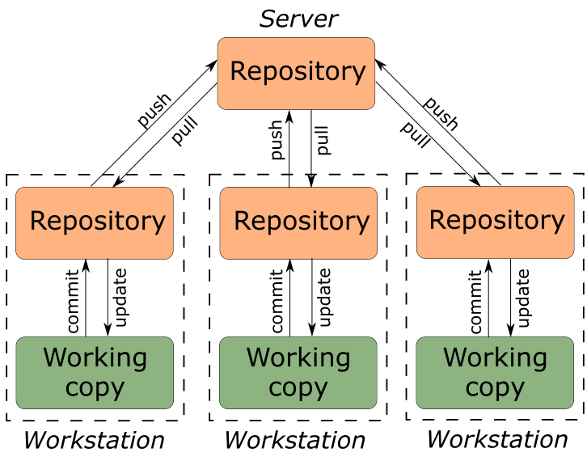

[<к содержанию](/readme.md)


## 1.1. О системе контроля версий

***Система контроля версий*** (сокр. - СКВ) - это система, записывающая изменения в файл или набор файлов в течение времени и позволяющая вернуться позже к определённой версии.

Существуют 3 вида систем контроля версий:
```
1. Локальные;
2. Централизованные;
3. Распределенные. 
```

**Локальные системы контроля версий**

Локальные СКВ обычно хранят на компьютере список изменений, внесенных в файлы. Основываясь на этих данных, система контроля версий воссоздает нужную версию файла (актуальную на определенный момент времени)


**Централизованные системы контроля версий**

Такие системы используют единственный сервер содержащий все версии файлов, и некоторое количество клиентов, которые получают файлы из этого централизованного хранилища. Применение ЦСКВ являлось стандартом на протяжении многих лет.


**Распределенная система контроля версий**

Они подразумевают, что клиент выкачает себе весь репозиторий целиком заместо выкачки конкретных интересующих клиента файлов. Если умрет любая копия репозитория, то это не приведет к потере кодовой базы, поскольку она может быть восстановлена с компьютера любого разработчика.

```
Репозиторий - это хранилище каких-либо данных. В случае с системой контроля версий, репозиторий — хранилище, содержащее программный код IT-проекта.
```

