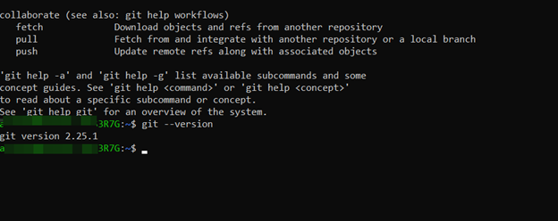

[<к содержанию](/readme.md)

## 2. Установка Git. 

**Установка GIT в Windows**


---
---

Перед тем как скачивать и устанавливать GIT, необходимо проверить установлен ли он на Ваш компьютер. 

Проверка наличия *GIT*:
> git --version

Если *GIT* был уже установлен на Ваш компьютер, то Вы увидете следующую информацию:


Если же данная информация не отоброзиться, значит необходимо установить *GIT*. Чтобы это сделать перейдите по данной [ссылке](https://git-scm.com/download/win), скачайте подходящую версию и следуйте дальнейшей инструкции. 

**Установка GIT в Linux**

---
---
Как и в windows проверяем наличия GIT:

```
$ git --version
```



Выполните в терменали команду:

```
$ sudo apt install git
```

**Установка GIT в MacOS**

--- 
---

Самый простой — установить Xcode Command Line Tools. В версии Mavericks (10.9) и выше вы можете добиться этого, выполнив в терминале:

```
$ git --version
```
Если Git не установлен, вам будет предложено его установить.

Существует множество способов установки *GIT*. Изучить Вы их можете на [официальном сайте GIT](https://git-scm.com/book/ru/v2/%D0%92%D0%B2%D0%B5%D0%B4%D0%B5%D0%BD%D0%B8%D0%B5-%D0%A3%D1%81%D1%82%D0%B0%D0%BD%D0%BE%D0%B2%D0%BA%D0%B0-Git).