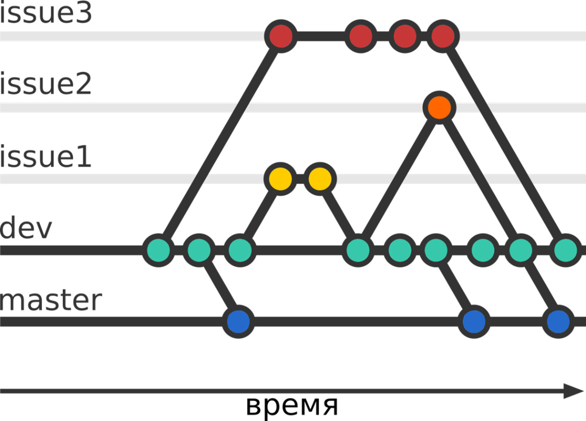
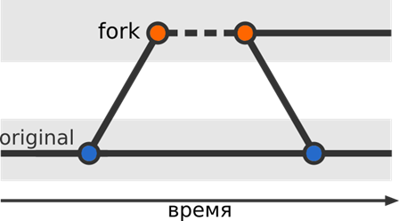
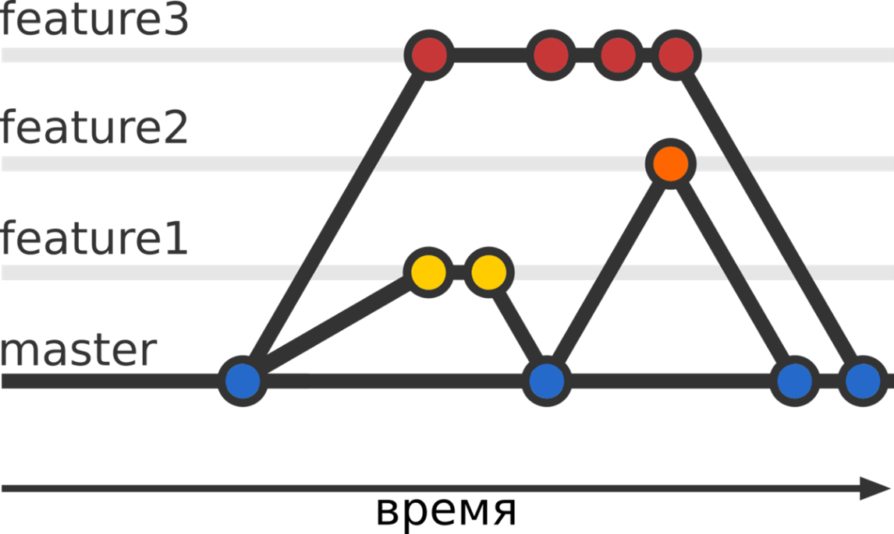
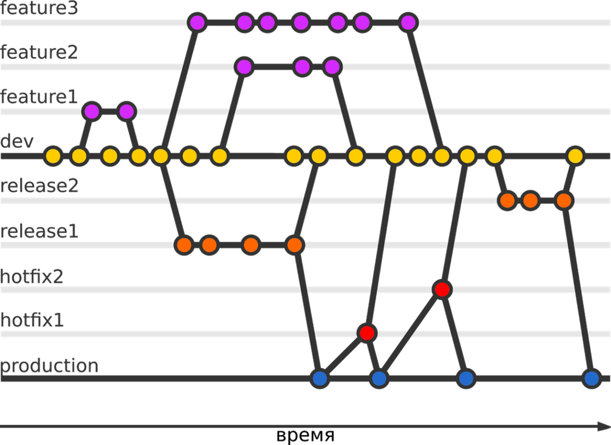

[<к содержанию](/readme.md)

## 6. Методология ветвления

Существует множество способов применения git в проекте, а также сотрудничества с другими разработчиками. Помимо использования git для контроля версий кода вашего проекта, его можно использовать для координации того, как другие работают над проектом. Эффективнее всего этого можно достичь, применив какую-либо модель ветвления.

> *Workflow, то есть модель ветвления в git это практика, упрощающая работу над проектом.Её смысл в том чтобы организовать, добавление и публикацию изменений в исходном коде репозитория. Наиболее эффективным для проектов является наличие удаленного репозитория.* 

Модель ветвления это не правило, которому нужно следовать, а скорее путеводитель. Поэтому можете просто выбрать определенные аспекты и сочетать их так как вам нужно.

Рассмотрим ниже несколько моделей ветления. Для этого предположим, что Ваша ветка это **master**. 

***1. Central Workflow***

---

Репозиторий содержит только одну главную ветку master. Все изменения комитятся в нее. Репозиторий может быть локальным, без удаленных копий или храниться удаленно, где он может быть клонирован или запушен.

**Когда использовать**

Идеально подходит для одиночного проекта. В своем проекте вы сможете использовать эту модель, для того чтобы видеть какие изменения произошли в течение процесса разработки. После проделанной работы вы коммитите изменения так, что позже сможете вернуться к любой из предыдущих версий. Также она отлично подойдет для небольших команд которые перешли от syn к git.

***2. Developer Branch Workflow***

---
У каждого разработчика есть своя личная ветка или несколько, в которые он пушит. Все изменения, опубликованные в удаленном репозитории будут в этой ветке. Вся работа может быть выполнена на разных ветках, но потом должна будет слита(merged) в одну главную ветвь.

**Когда использовать**

Больше подойдет для небольшого проекта с ограниченным количеством требований и небольшим количеством разработчиков, которым нужно чтобы их изменения в проекте были просмотрены до слияния с веткой master. Допустим у вас групповое задание, каждый участник делает свою часть, а затем публикует её в удаленном репозитории для того чтобы остальные её увидели до того, как она будет слита. В идеале это должно быть сделано с помощью запроса pull (merge). Также это может стать удобным способом для представления пулла в команде или организации.

***3. Feature Branch Workflow***

---
В своей простейшей форме репозиторий мог бы иметь основную ветку со стабильным, доступным кодом и другими ветками для разных фич (или багов, или улучшений), которые можно бы было интегрировать в главную ветку. То есть репозиторий будет иметь второстепенную основную ветку (dev) которая будет хранить тестируемый стабильный код для отправки пользователям, когда он будет слит с master. В этом случае ветка с фичами будет слита с dev, а не с master.

**Когда использовать**

Этот подход больше подходит командам, которые используют какой-то метод по управлению проектами(например Agile). Давайте скажем, что ваш проект находится в продолжительной разработке и вам нужно добавить набор фич до следующего релиза. Эти фичи назначены разным разработчикам, которые создают отдельную ветку для каждой опубликованной фичи до того, как она будет слита с dev для тестирования. Когда вы готовы к релизу, dev сливается с master.

***4. Issue Branch Workflow***

---
Очень похожа на предыдущую модель с одним лишь различием. Ветки создаются из заданий в проектном трекере. Ветки могут иметь одинаковые названия id заданий. И здесь только одна ветка на задание и одно задание на ветку.

**Когда использовать**

Лучше всего подойдет проектам, которые управляются по какому-то методу. Однако, несмотря на это, больше подходит тем проектам, в которых фичи готовятся не одним разработчиком. Например, если бы вы работали над самим интерфейсом, а другой разработчик бы работал над его другим аспектом. Он может быть применен в обоих проектах, релизы которых выходят постоянно или время от времени.

***5. Forking Workflow***

---
Благодаря этой модели, дополнения проекта осуществляются путем создания разветвления его репозитория. Все изменения фиксируются в любой ветке репозитория, а затем возвращаются в исходное хранилище с pull запросом. Разработчики будут иметь доступ только к чтению в удаленном репозитории.

**Когда использовать**

Чаще всего используется в проектах с открытым исходным кодом и публичными репозиториями. Каждый кто может просматривать репозиторий может сделать разветвление. До тех пор, пока они могут просматривать репозиторий им не нужен доступ для того чтобы внести изменения напрямую в репозиторий. Когда они закончили свою работу, они могут сделать запрос, который вы будете рассматривать и решите, что же с ним делать, интегрировать, отказать или просить доработать до окончательного слияния с проектом.

***6. Patch Workflow***

---

Используя этот подход, разработчики добавляют изменения в репозиторий вместе с патчем - файлом, который содержит все изменения в репозитории. Этот патч применяется кем-то, кто может напрямую писать в репозиторий, например maintainer/owner.

**Когда использовать**

Используется если разработчик не может напрямую писать в репозиторий, но имеет доступ к исходному коду. Если, например, вы поделились кодом своего проекта с другом или он получил доступ к вашему удаленному репозиторию. После тех изменений, которые вы закомиттили в их копию исходного кода создается патч и отправляется вам. Вы применяете их к репозиторию чтобы обновить его. Также используется теми, кто не является главным разработчиком проекта.

***7. Github flow***

---
Команда Github предпочитает достаточно простую стратегию ветвления, которую можно описать несколькими правилами:
* Код в master ветке должен быть работоспособным и готовым к развертыванию в любое время;
*	Все изменения производятся в отдельных ветках, созданных от master;
*	Когда изменение завершено, его проверяет руководитель команды и ещё один специалист;
*	После удачной проверки изменения его вливают в проект и немедленно разворачивают на сервере.

**Когда использовать**

Стратегия может вполне подойти командам, работающий по гибким методологиям управления проектами и учебным командам.

***8. Gitflow***

---

В целом, Gitflow состоит из двух постоянных веток и нескольких типов временных веток.

Существует две постоянных ветки:

*	**production** (обычно — master) — стабильная ветка, доступная пользователям. Напрямую в production изменения не производятся;

*	**develop** — ветка для разработки. Потенциально она может быть нестабильна. При достаточном количестве изменений из develop создаётся release-ветка. Feature-ветки берут свое начало от develop.

Остальные ветки делятся на три группы:

*	**feature** — ветки, на которых разрабатывается новый функционал. При завершении работы над функционалом feature-ветки сливаются в develop;
*	**release** — ветки, на которых идёт подготовка стабильного кода для публикации пользователям. По завершении работ по «стабилизации» кода, ветка сливается в production и develop;
*	**hotfix** — ветки, служащие для быстрого решения критических проблем production. По завершении работ по решению ошибки, ветка сливается в production и develop.

**Когда использовать**

Данная модель подходит для организации рабочего процесса на основе релизов.